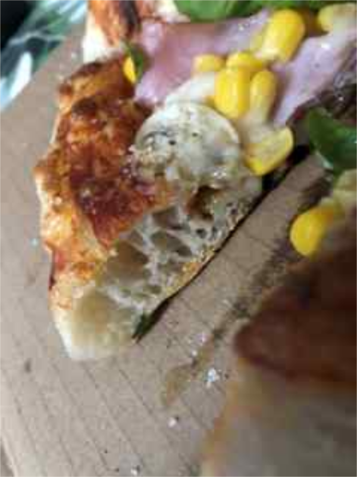

# 🧪 LABORATORNÍ ZÁPIS

## Postup přípravy diskoidního substrátu ve „Hypertermickém komorovém expanzoru kvasinkové matrice“

**Protokolární dokumentace – 2 porce**

---

## 1. Surovinová matice

| Složka | Technické označení | Množství |
|---|---|---:|
| Pšeničná mouka | *Glutinus Triticum pulveris* – mouka s deklarovaným glutenovým indexem přibližně 37 % | 240 g |
| Pitná voda | *Aqua potabilis urbana* – kohoutková voda ze síťového rozvodu | 200 g |
| Instantní droždí | *Saccharomyces cerevisiae activus* | 2,5 g |
| Kuchyňská sůl | *Sodium chloratum purificatum* – NaCl | 5 g |

> 🛑 **Interfázová lubrikace:** *Oleum Olivarum extra virgine* se neinkorporuje do těsta. Aplikuje se pouze na vnitřní povrch fermentačních nádob za účelem omezení adhezivního tření a usnadnění pozdější extrakce substrátu.

### Hydratační poměr

- voda vůči mouce: **83,3 %**,
- sůl vůči mouce: **2,1 %**,
- instantní droždí vůči mouce: **1,04 %**.

Jedná se tedy o vysoce hydratovanou matrici, u níž se očekává zvýšená alveolární expanze, ale zároveň vyšší náročnost manipulace.

---

## 2. Biomechanická polymerace

Všechny agens byly zpracovány rotačně-axiálním hnětačem do fáze rozvlásnění lepku a vzniku elastické, soudržné a relativně plynotěsné glutenové sítě.

### Cílové vlastnosti matrice

- souvislá elastická struktura,
- schopnost zadržovat fermentační CO₂,
- vysoká extensibilita bez okamžitého protržení,
- minimální výskyt nespojených moučných agregátů.

Proces byl ukončen po dosažení soudržného těsta s rozvinutou glutenovou strukturou.

---

## 3. Fermentační režim – spodní cryofilní fáze

| Parametr | Hodnota |
|---|---:|
| Teplota | 4–5 °C |
| Doba | 72 hodin |
| Počet reaktorů | 2 individuální nádoby |
| Lubrikace nádoby | *Oleum Olivarum extra virgine* |

### Účel režimu

- zpomalení kvasinkové aktivity,
- prodloužení enzymatických procesů,
- rozvoj aromatické komplexity,
- zvýšení velikosti a nepravidelnosti pórů,
- zlepšení extensibility při diskové expanzi.

Po fermentaci byla matrice vyjmuta z chladicího prostředí a temperována do stavu vhodného pro ruční expanzi.

---

## 4. Disková expanze

Fermentovaný substrát byl zpracován šetrnou radiální deformací bez násilného vytlačení plynné fáze z okrajového prstence.

### Manipulační zásady

1. Střed matrice zploštit tlakem prstů.
2. Zachovat zesílený periferní prstenec.
3. Disk roztahovat postupně od středu k obvodu.
4. Nepoužívat váleček, který by odstranil většinu fermentačních dutin.
5. Po dosažení požadovaného průměru přenést disk na pracovní nosič.

---

## 5. Náplňová depozice

Po temperování a diskové expanzi byly jednotlivé vrstvy aplikovány v následujícím pořadí.

### Primární rajčatová fáze

- *Solanum lycopersicum* – rajčatový protlak,
- *Allium sativum* – 1 mikronizovaný stroužek,
- *Origanum vulgare* – sušené listy.

Rajčatová složka byla smísena s česnekem a nanesena v tenké vrstvě tak, aby nedošlo k nadměrnému zvýšení vodní aktivity povrchu.

### Proteinová a zeleninová fáze

- mozzarella medium – strouhaná fermentovaná mléčná proteinová složka *Bos taurus*,
- *Sus scrofa domesticus* – šunka,
- *Agaricus bisporus* – žampion dvouvýtrusý,
- *Zea mays saccharata* – sterilizovaná kukuřice cukrová.

Náplň byla distribuována rovnoměrně s omezením hmotnostního přetížení středu disku.

---

## 6. Hypertermická aktivace

| Parametr | Hodnota |
|---|---:|
| Teplota komory | 300–350 °C |
| První interval | 150 sekund |
| Mezioperace | rotace rCW o 90° |
| Druhý interval | 150 sekund |
| Celkový čas | přibližně 300 sekund |

### Pozorované a očekávané děje

- prudká expanze zadrženého CO₂,
- odpařování části volné vody,
- stabilizace glutenové sítě,
- tavení a povrchové hnědnutí sýrové fáze,
- Maillardovy reakce na okrajovém prstenci,
- tvorba mechanicky stabilní a křupavé kůrky.

Rotace o 90° kompenzovala nehomogenitu teplotního pole komory a omezila jednostranné přepálení.

---

## 7. Postexpanzní fáze a servírovací protokol

### Umístění na celulózový substrát

Po vyjmutí z komory byl produkt umístěn na kartonový podklad.

Funkce podkladu:

- absorpce přebytečných lipidů,
- umožnění odvodu zbytkové vodní páry,
- omezení kondenzace na spodní kůrce.

### Časové ochlazení

Produkt byl ponechán přibližně **10–20 sekund** bez finální aromatizace.

Cílem bylo omezit tepelnou degradaci citlivých aromatických složek a zabránit jejich okamžitému odpaření.

### Volitelná finalizace

- jemně strouhaný *Parmigiano Reggiano*,
- mikroaplikace *Oleum Olivarum extra virgine* až po mírném ochlazení,
- *Ocimum basilicum* – celé čerstvé bazalkové listy bez mechanického poškození.

---

## 8. Výsledek experimentu

Výsledný produkt vykazoval:

- výrazně alveolární vnitřní strukturu okrajového prstence,
- tenkou a pevnou spodní vrstvu,
- dobrou stabilitu při vysoké hydrataci,
- rovnoměrně tepelně upravenou náplň,
- kontrast křupavého povrchu a měkké střídy,
- aromatickou rovnováhu rajčat, česneku, oregana, sýra a čerstvé bazalky.

Fotodokumentace potvrzuje vznik nepravidelných pórů a dobře expandovaného okraje. Na řezu je patrná otevřená střídka s tenkými přepážkami, odpovídající dlouhé studené fermentaci a rychlé hypertermické aktivaci.

---

## ✅ Konečný produkt

**Vysoce alveolární, aromaticky vrstvený diskovitý artefakt s komplexní texturou, optimalizovaným chuťovým spektrem a vizuálně-kulinarizační rovnováhou.**

---

## Poznámky pro další iteraci

- Ověřit opakovatelnost při přesně zaznamenané teplotě těsta před pečením.
- Zaznamenat průměr disku a hmotnost jednotlivé fermentační dávky.
- Porovnat 72hodinovou fermentaci s variantou 48 a 96 hodin.
- Změřit teplotu pečicí plochy nezávisle na indikaci komory.
- Vyzkoušet předchlazení mokrých složek náplně a důkladnější odvodnění žampionů a kukuřice.
